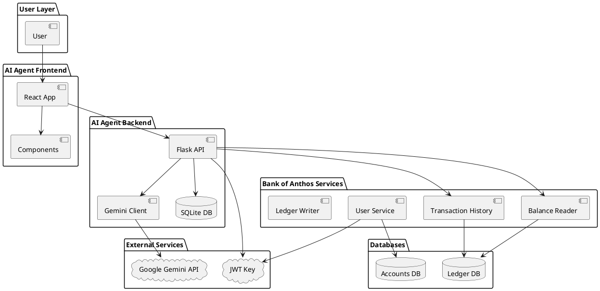

# AI Agent Architecture - PowerPoint Rough Draft

## Detailed Mermaid Diagram for PowerPoint Recreation

```mermaid
 TB
    %% User Layer
    User["👤 User<br/>Web Browser"]
    
    %% AI Agent Frontend Components
    subgraph AI_Frontend["AI Agent Frontend (React - Port 3000)"]
        Dashboard["Dashboard<br/>Main Interface"]
        GoalBar["GoalBar<br/>Goal Setting & Progress"]
        ChallengeList["ChallengeList<br/>AI Challenges Display"]
        AchievementBadges["AchievementBadges<br/>XP & Badges"]
        StreakTracker["StreakTracker<br/>Daily Progress"]
        Leaderboard["Leaderboard<br/>User Rankings"]
        BankConnection["BankConnection<br/>Demo vs Real Mode"]
    end
    
    %% AI Agent Backend Services
    subgraph AI_Backend["AI Agent Backend (Flask - Port 8080)"]
        FlaskAPI["Flask API Server<br/>Main Backend"]
        
        subgraph API_Endpoints["API Endpoints"]
            GoalsAPI["Goals API<br/>POST/GET /goals/{user_id}<br/>• Set financial goals<br/>• Parse with AI<br/>• Store in SQLite"]
            ChallengesAPI["Challenges API<br/>GET /challenges/{user_id}<br/>• Generate AI challenges<br/>• Analyze spending patterns<br/>• Return personalized tasks"]
            ProfileAPI["Profile API<br/>GET /user-profile/{user_id}<br/>• Get balance & transactions<br/>• Aggregate user data<br/>• Return financial context"]
            AchievementsAPI["Achievements API<br/>GET /achievements/{user_id}<br/>• Generate AI badges<br/>• Track progress milestones<br/>• Motivational messages"]
            TasksAPI["Tasks API<br/>GET /additional-tasks/{user_id}<br/>• Micro-tasks generation<br/>• Quick actionable items<br/>• Context-aware suggestions"]
            StreakAPI["Streak API<br/>GET /streak-message/{user_id}<br/>• Daily streak tracking<br/>• Motivational messages<br/>• Progress encouragement"]
        end
        
        subgraph AI_Processing["AI Processing"]
            GeminiClient["Gemini AI Client<br/>Google Gemini 2.5 Flash<br/>• Goal parsing (amount, emoji, category)<br/>• Challenge generation<br/>• Achievement creation<br/>• Motivational messages"]
        end
        
        subgraph Data_Storage["Data Storage"]
            SQLiteDB["SQLite Database<br/>ai_agent.db<br/>• users table<br/>• goals table<br/>• challenges table<br/>• progress table"]
        end
    end
    
    %% Bank of Anthos Microservices
    subgraph Bank_Anthos["Bank of Anthos Microservices"]
        subgraph Account_Services["Account Services"]
            UserService["User Service<br/>Port 8080<br/>• JWT token generation<br/>• User authentication<br/>• Profile management<br/>• Account creation"]
            BalanceReader["Balance Reader<br/>Port 8080<br/>• GET /balances/{user_id}<br/>• Real-time balance data<br/>• Account balance retrieval<br/>• Cached for performance"]
        end
        
        subgraph Transaction_Services["Transaction Services"]
            TransactionHistory["Transaction History<br/>Port 8080<br/>• GET /transactions/{user_id}<br/>• Transaction list retrieval<br/>• Spending pattern data<br/>• Recent activity tracking"]
            LedgerWriter["Ledger Writer<br/>Port 8080<br/>• POST /transactions<br/>• Transaction processing<br/>• Ledger updates<br/>• Payment processing"]
        end
        
        subgraph Bank_Frontend["Bank Frontend"]
            BankFrontend["Bank of Anthos Frontend<br/>Port 8080<br/>• User login interface<br/>• Account management<br/>• Transaction history view<br/>• Balance display"]
        end
    end
    
    %% External Services
    subgraph External_Services["External Services"]
        GoogleGemini["Google Gemini API<br/>AI/ML Services<br/>• Natural language processing<br/>• Goal parsing algorithms<br/>• Challenge generation<br/>• Achievement creation"]
        JWTSecret["JWT Key Secret<br/>Authentication<br/>• RSA256 private key<br/>• Token signing<br/>• Service authentication<br/>• Secure communication"]
    end
    
    %% Database Layer
    subgraph DB_Layer["Database Layer"]
        AccountsDB["Accounts Database<br/>PostgreSQL<br/>• User accounts<br/>• Profile information<br/>• Authentication data<br/>• Account settings"]
        LedgerDB["Ledger Database<br/>PostgreSQL<br/>• Transaction records<br/>• Balance information<br/>• Payment history<br/>• Financial data"]
    end
    
    %% Kubernetes Infrastructure
    subgraph K8s_Cluster["Kubernetes Cluster"]
        subgraph AI_Namespace["AI Agent Namespace"]
            AIAgentPod["AI Agent Pod<br/>• Backend container<br/>• Frontend container<br/>• Shared storage<br/>• Environment config"]
        end
        
        subgraph Bank_Namespace["Bank of Anthos Namespace"]
            BankPods["Bank of Anthos Pods<br/>• All microservices<br/>• Service mesh integration<br/>• Load balancing<br/>• Health monitoring"]
        end
        
        subgraph Infra_Services["Infrastructure Services"]
            Istio["Istio Service Mesh<br/>• Service discovery<br/>• mTLS security<br/>• Traffic management<br/>• Observability"]
            Ingress["Ingress Controller<br/>• External access<br/>• SSL termination<br/>• Load balancing<br/>• Routing rules"]
        end
    end
    
    %% User Flow Connections
    User --> BankFrontend
    User --> Dashboard
    Dashboard --> GoalBar
    Dashboard --> ChallengeList
    Dashboard --> AchievementBadges
    Dashboard --> StreakTracker
    Dashboard --> Leaderboard
    Dashboard --> BankConnection
    
    %% Frontend to Backend
    GoalBar --> GoalsAPI
    ChallengeList --> ChallengesAPI
    AchievementBadges --> AchievementsAPI
    StreakTracker --> StreakAPI
    BankConnection --> ProfileAPI
    
    %% Backend Internal Connections
    FlaskAPI --> GoalsAPI
    FlaskAPI --> ChallengesAPI
    FlaskAPI --> ProfileAPI
    FlaskAPI --> AchievementsAPI
    FlaskAPI --> TasksAPI
    FlaskAPI --> StreakAPI
    
    GoalsAPI --> GeminiClient
    ChallengesAPI --> GeminiClient
    AchievementsAPI --> GeminiClient
    TasksAPI --> GeminiClient
    StreakAPI --> GeminiClient
    
    GoalsAPI --> SQLiteDB
    ChallengesAPI --> SQLiteDB
    AchievementsAPI --> SQLiteDB
    TasksAPI --> SQLiteDB
    StreakAPI --> SQLiteDB
    
    %% Bank of Angraphthos Integration
    ProfileAPI --> BalanceReader
    ProfileAPI --> TransactionHistory
    ChallengesAPI --> BalanceReader
    ChallengesAPI --> TransactionHistory
    TasksAPI --> BalanceReader
    TasksAPI --> TransactionHistory
    
    %% External API Calls
    GeminiClient --> GoogleGemini
    
    %% Bank of Anthos Internal Connections
    BalanceReader --> LedgerDB
    TransactionHistory --> LedgerDB
    UserService --> AccountsDB
    LedgerWriter --> LedgerDB
    
    %% Authentication Flow
    UserService --> JWTSecret
    FlaskAPI --> JWTSecret
    BalanceReader --> JWTSecret
    TransactionHistory --> JWTSecret
    
    %% Infrastructure Connections
    AIAgentPod --> Istio
    BankPods --> Istio
    Istio --> Ingress
    Ingress --> User
    
    %% Styling
    classDef userClass fill:#e1f5fe,stroke:#01579b,stroke-width:3px
    classDef aiFrontendClass fill:#f3e5f5,stroke:#4a148c,stroke-width:2px
    classDef aiBackendClass fill:#e8eaf6,stroke:#3f51b5,stroke-width:2px
    classDef bankServiceClass fill:#e8f5e8,stroke:#1b5e20,stroke-width:2px
    classDef externalClass fill:#fff3e0,stroke:#e65100,stroke-width:2px
    classDef dbClass fill:#fce4ec,stroke:#880e4f,stroke-width:2px
    classDef infraClass fill:#f1f8e9,stroke:#33691e,stroke-width:2px
    
    class User userClass
    class Dashboard,GoalBar,ChallengeList,AchievementBadges,StreakTracker,Leaderboard,BankConnection aiFrontendClass
    class FlaskAPI,GoalsAPI,ChallengesAPI,ProfileAPI,AchievementsAPI,TasksAPI,StreakAPI,GeminiClient,SQLiteDB aiBackendClass
    class UserService,BalanceReader,TransactionHistory,LedgerWriter,BankFrontend bankServiceClass
    class GoogleGemini,JWTSecret externalClass
    class AccountsDB,LedgerDB dbClass
    class AIAgentPod,BankPods,Istio,Ingress infraClass
```

## Code Organization Diagram

```mermaid
graph TD
    %% Root Directory
    Root["bank-of-anthos/"]
    
    %% AI Agent Directory
    subgraph AI_Agent["src/ai-agent/"]
        subgraph AI_Backend["backend/"]
            MainPy["main.py<br/>Flask API Server"]
            GeminiClient["gemini_client.py<br/>AI Integration"]
            Database["database.py<br/>SQLite Operations"]
            Requirements["requirements.in<br/>Python Dependencies"]
            Dockerfile["Dockerfile<br/>Container Build"]
        end
        
        subgraph AI_Frontend["frontend/"]
            subgraph Src["src/"]
                AppJS["App.js<br/>Main React Component"]
                IndexJS["index.js<br/>React Entry Point"]
                subgraph Components["components/"]
                    Dashboard["Dashboard.js"]
                    GoalBar["GoalBar.js"]
                    ChallengeList["ChallengeList.js"]
                    AchievementBadges["AchievementBadges.js"]
                    StreakTracker["StreakTracker.js"]
                    Leaderboard["Leaderboard.js"]
                    BankConnection["BankConnection.js"]
                end
                subgraph Services["services/"]
                    API["api.js<br/>API Calls"]
                end
                subgraph Styles["styles/"]
                    IndexCSS["index.css<br/>Global Styles"]
                end
            end
            PackageJSON["package.json<br/>Node Dependencies"]
            Public["public/<br/>Static Assets"]
        end
        
        subgraph AI_K8s["k8s/"]
            BaseYAML["base/ai-agent.yaml<br/>K8s Manifests"]
            Kustomization["base/kustomization.yaml<br/>Kustomize Config"]
        end
        
        README["README.md<br/>Documentation"]
    end
    
    %% Bank of Anthos Directories
    subgraph Bank_Services["src/"]
        Frontend["frontend/<br/>Bank Frontend"]
        Accounts["accounts/<br/>Account Services"]
        Ledger["ledger/<br/>Transaction Services"]
        LoadGenerator["loadgenerator/<br/>Load Testing"]
    end
    
    %% Kubernetes Manifests
    subgraph K8s_Manifests["kubernetes-manifests/"]
        BalanceReader["balance-reader.yaml"]
        TransactionHistory["transaction-history.yaml"]
        UserService["userservice.yaml"]
        FrontendYAML["frontend.yaml"]
        Config["config.yaml"]
    end
    
    %% Root Files
    Root --> AI_Agent
    Root --> Bank_Services
    Root --> K8s_Manifests
    Root --> README["README.md"]
    Root --> Makefile["Makefile"]
    Root --> Skaffold["skaffold.yaml"]
    
    %% AI Agent Structure
    AI_Agent --> AI_Backend
    AI_Agent --> AI_Frontend
    AI_Agent --> AI_K8s
    AI_Agent --> README
    
    %% Backend Files
    AI_Backend --> MainPy
    AI_Backend --> GeminiClient
    AI_Backend --> Database
    AI_Backend --> Requirements
    AI_Backend --> Dockerfile
    
    %% Frontend Structure
    AI_Frontend --> Src
    AI_Frontend --> PackageJSON
    AI_Frontend --> Public
    
    %% Frontend Source
    Src --> AppJS
    Src --> IndexJS
    Src --> Components
    Src --> Services
    Src --> Styles
    
    %% Components
    Components --> Dashboard
    Components --> GoalBar
    Components --> ChallengeList
    Components --> AchievementBadges
    Components --> StreakTracker
    Components --> Leaderboard
    Components --> BankConnection
    
    %% Services
    Services --> API
    
    %% Styles
    Styles --> IndexCSS
    
    %% K8s Files
    AI_K8s --> BaseYAML
    AI_K8s --> Kustomization
    
    %% Styling
    classDef rootClass fill:#e3f2fd,stroke:#1976d2,stroke-width:3px
    classDef aiAgentClass fill:#f3e5f5,stroke:#7b1fa2,stroke-width:2px
    classDef backendClass fill:#e8eaf6,stroke:#3f51b5,stroke-width:2px
    classDef frontendClass fill:#e0f2f1,stroke:#00695c,stroke-width:2px
    classDef componentClass fill:#fff3e0,stroke:#f57c00,stroke-width:2px
    classDef bankClass fill:#e8f5e8,stroke:#388e3c,stroke-width:2px
    classDef k8sClass fill:#fce4ec,stroke:#c2185b,stroke-width:2px
    
    class Root,README,Makefile,Skaffold rootClass
    class AI_Agent,AI_Backend,AI_Frontend,AI_K8s aiAgentClass
    class MainPy,GeminiClient,Database,Requirements,Dockerfile backendClass
    class Src,AppJS,IndexJS,Services,API,Styles,IndexCSS,PackageJSON,Public frontendClass
    class Components,Dashboard,GoalBar,ChallengeList,AchievementBadges,StreakTracker,Leaderboard,BankConnection componentClass
    class Bank_Services,Frontend,Accounts,Ledger,LoadGenerator bankClass
    class K8s_Manifests,AI_K8s,BaseYAML,Kustomization,BalanceReader,TransactionHistory,UserService,FrontendYAML,Config k8sClass
```



## Data Flow Description

### 1. User Authentication & Profile
1. User logs in through Bank of Anthos frontend
2. UserService generates JWT token
3. AI Agent receives JWT token for authentication
4. AI Agent calls Balance Reader and Transaction History services
5. User profile data is aggregated and returned

### 2. Goal Setting & AI Processing
1. User sets financial goal through React frontend
2. Goal is parsed by Gemini AI (extracts amount, emoji, category)
3. Parsed goal is stored in SQLite database
4. Goal data is used for personalized challenge generation

### 3. Challenge Generation
1. AI Agent retrieves user's financial data (balance, transactions)
2. Gemini AI analyzes spending patterns and user goal
3. Personalized challenge is generated with difficulty, XP reward, tips
4. Challenge is stored in SQLite and returned to frontend

### 4. Achievement System
1. User stats (XP, level, completed challenges) are tracked
2. Gemini AI generates personalized achievement badges
3. Static fallback achievements if AI fails
4. Progress tracking and streak monitoring

## How to Create Your Own Architecture Diagram

### Method 1: Using Mermaid (Recommended)

1. **Online Mermaid Editor:**
   - Go to [mermaid.live](https://mermaid.live)
   - Copy the diagram code above
   - Paste it into the editor
   - Export as PNG, SVG, or PDF

2. **VS Code with Mermaid Extension:**
   - Install "Mermaid Preview" extension
   - Create a `.md` file with the diagram code
   - Use Ctrl+Shift+P → "Mermaid Preview"

3. **GitHub/GitLab:**
   - Create a `.md` file with the diagram code
   - GitHub/GitLab will render it automatically

### Method 2: Using Draw.io (diagrams.net)

1. **Create New Diagram:**
   - Go to [app.diagrams.net](https://app.diagrams.net)
   - Choose "Blank Diagram"

2. **Add Components:**
   - Use rectangles for services
   - Use cylinders for databases
   - Use circles for external services
   - Use arrows for data flow

3. **Organize in Layers:**
   - **User Layer:** User icon
   - **Frontend Layer:** React components
   - **Backend Layer:** Flask API and AI services
   - **Bank Services Layer:** Microservices
   - **Database Layer:** SQLite and PostgreSQL
   - **Infrastructure Layer:** Kubernetes and Istio

### Method 3: Using Lucidchart

1. **Create Account:** Sign up at [lucidchart.com](https://lucidchart.com)
2. **Choose Template:** Select "System Architecture" template
3. **Add Shapes:**
   - **Processes:** Rectangles for services
   - **Data Stores:** Cylinders for databases
   - **External Entities:** Circles for external APIs
   - **Data Flow:** Arrows with labels

### Method 4: Using PlantUML



### Method 5: Using PowerPoint/Google Slides

1. **Create Slides:**
   - Use shapes for components
   - Use different colors for different layers
   - Use arrows for connections

2. **Layer Organization:**
   - **Top:** User interface
   - **Middle:** Application services
   - **Bottom:** Data storage

## Key Integration Points

### 1. Authentication
- **JWT Token Flow:** Bank of Anthos → AI Agent
- **Service-to-Service:** AI Agent → Bank Services

### 2. Data Integration
- **Balance Data:** `GET /balances/{user_id}`
- **Transaction Data:** `GET /transactions/{user_id}`
- **User Profile:** JWT token parsing

### 3. AI Processing
- **Goal Parsing:** Natural language → structured data
- **Challenge Generation:** Financial data → personalized challenges
- **Achievement Generation:** User stats → motivational badges

### 4. Data Storage
- **AI Agent:** SQLite for goals, challenges, progress
- **Bank of Anthos:** PostgreSQL for accounts, transactions

## Security Considerations

1. **JWT Authentication:** All API calls require valid JWT tokens
2. **Service Mesh:** Istio provides mTLS between services
3. **Network Policies:** Kubernetes network isolation
4. **API Keys:** Gemini API key stored as environment variable

## Monitoring & Observability

1. **Health Checks:** `/ready` and `/healthy` endpoints
2. **Metrics:** Prometheus metrics collection
3. **Tracing:** Distributed tracing with Istio
4. **Logging:** Structured logging across services

This architecture diagram shows how the AI Agent integrates seamlessly with Bank of Anthos while maintaining separation of concerns and leveraging AI capabilities for personalized financial coaching.
